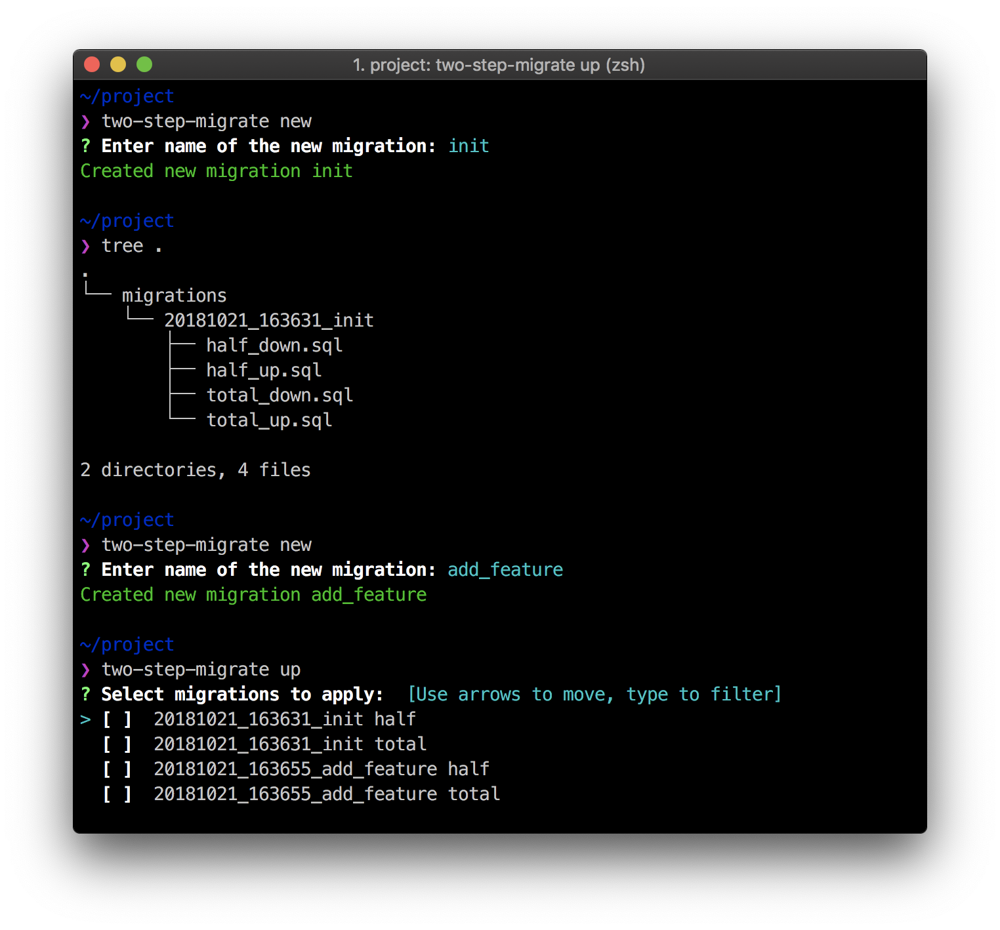

# _two-step_-migrate

SQL migration tool.



This is tool is adapted for seamless deployments of backend code. Each migration has two steps: _half_ and _total_.

_Half migration_ is backward-compatible database migration, which allows to work previous and next version of your backend code simultaneously. In this migration you cannot remove or rename columns because in that case the old backend code will break.

_Total migration_ is backward-not-compatible database migration.


<br>

## Installation

### Using precompiled binaries

The compiled binaries exist under the releases tab: https://github.com/reo7sp/two-step-migrate/releases

### Using docker

Use [reo7sp/two-step-migrate](https://hub.docker.com/r/reo7sp/two-step-migrate/) docker image.

### Using go

```sh
go get github.com/reo7sp/two-step-migrate
```


<br>

## Usage

```sh
two-step-migrate [command]
```

Available commands:
- `new`  — Create a new migration
- `up`   — Apply migration
- `down` — Rollback migration

Required environment variables:
- `DATABASE_URL` — DSN to the sql database.


<br>

## Caveats

Currently supports only PostgreSQL.
